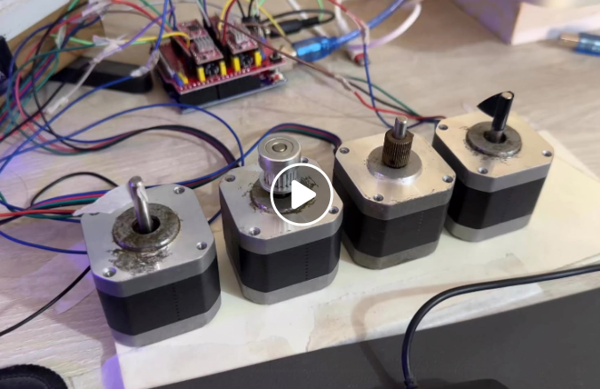
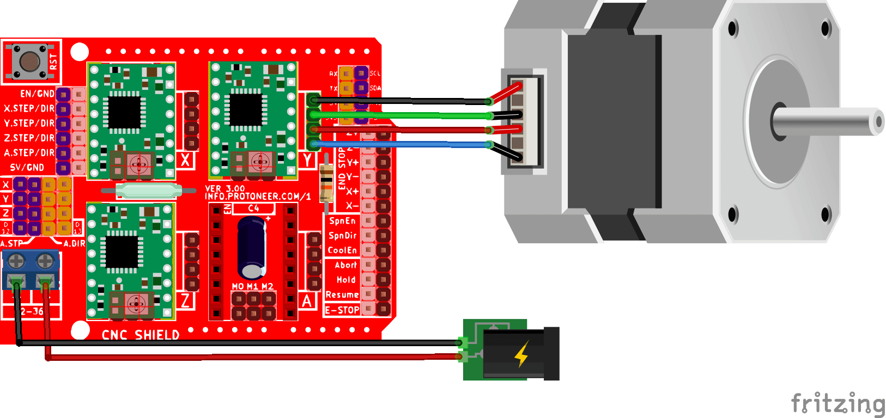
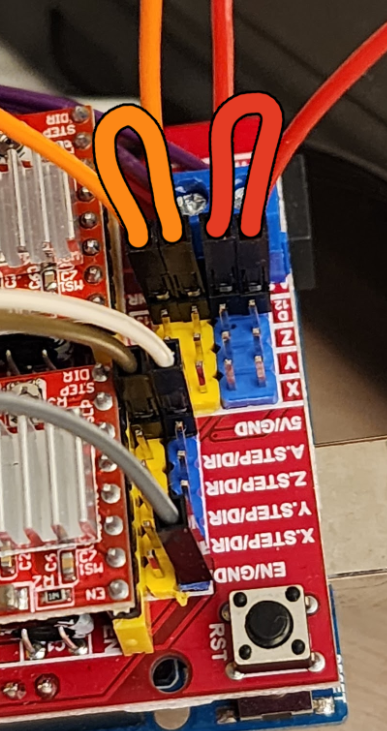

# Playing music with stepper motors

### Requirements
- 4 stepper motors
- 4 stepper motor drivers
- Arduino uno
- Arduino CNC shield
-[Node.js](https://nodejs.org/en/download/) installed

Simply plug in the motors and drivers to the CNC shield, connect the shield to the Arduin.
Here's an example on 1 motor connected. Connect all 4 motors in the same way to the CNC shield.

*for the forth A axis motor to work independently, you need to connect 2 jumper wires like this:*

### Usage
1. Clone the repository and navigate to the project directory.
2. Open terminal in *scripts* folder and run `npm install` to install the required dependencies.
3. Connect the Arduino to your computer and upload the `src/main.cpp` sketch to the Arduino using *PlatformIO* or *Arduino IDE*.
4. open `scripts/midi-sender.js` in a text editor and set the *ARDUINO_PORT* variable to the correct port where your Arduino is.
    * On windowns you can fine available ports by running `mode` in command prompt.
    * On linux & macOS you can find available ports by running `ls /dev/tty*` in terminal.
5. Run `npm start` in terminal (make sure you are in the *scripts* folder) to start the MIDI sender script. This will show you a list of available songs to play. Select a song by using up and down arrow keys and press enter to start playing the selected song.

## Additional Notes
if you want to add your own MIDI files, simply place them in `scripts/audio/og` folder and run `npm run clean` then the next time you run `npm start` you will see your own songs in the list of available songs to play.
*with only 4 stepper motors, you can only play very simple MIDI files, complex musics will sound very bad.*